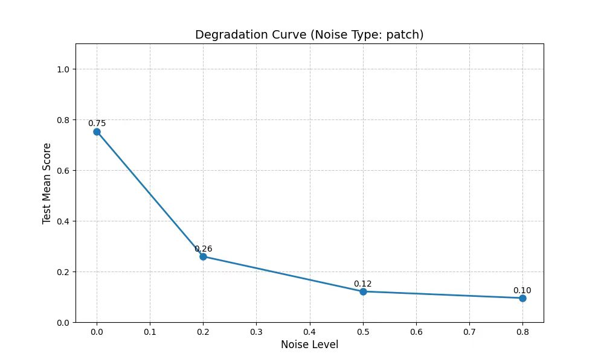
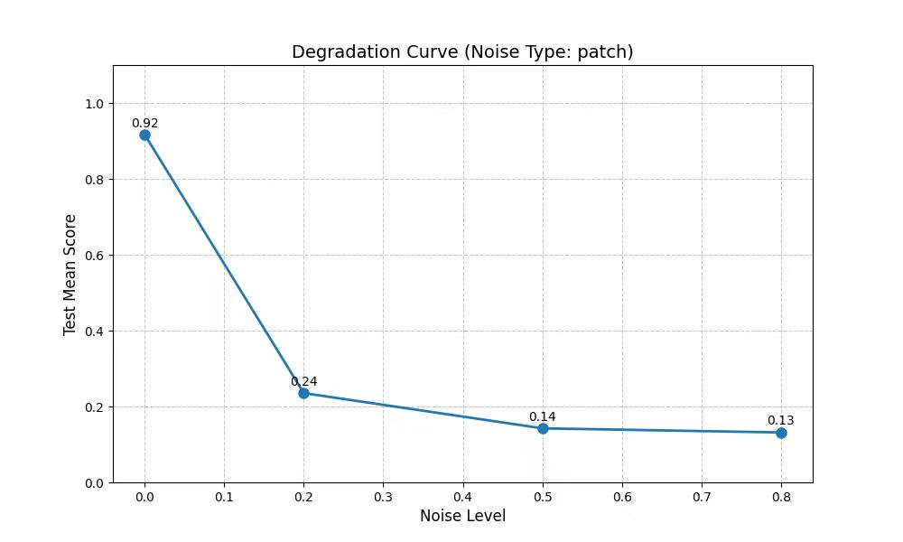
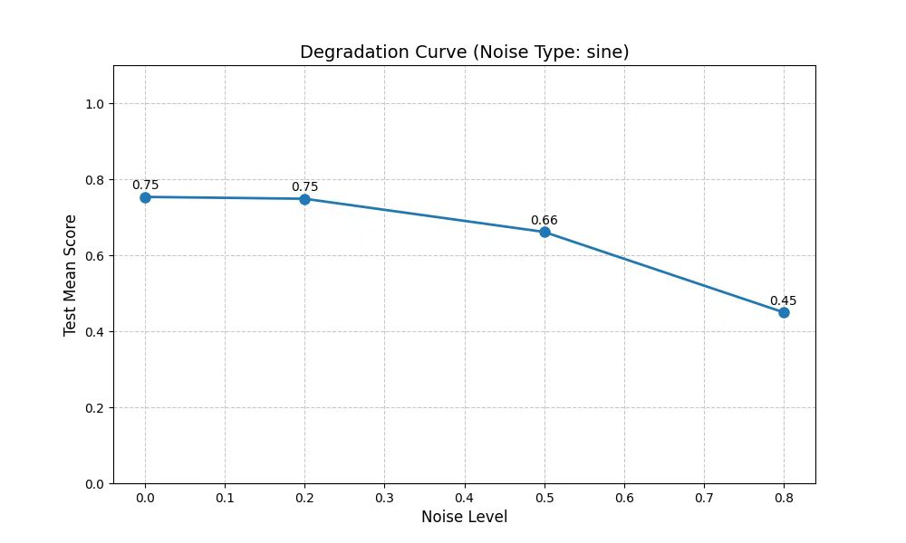
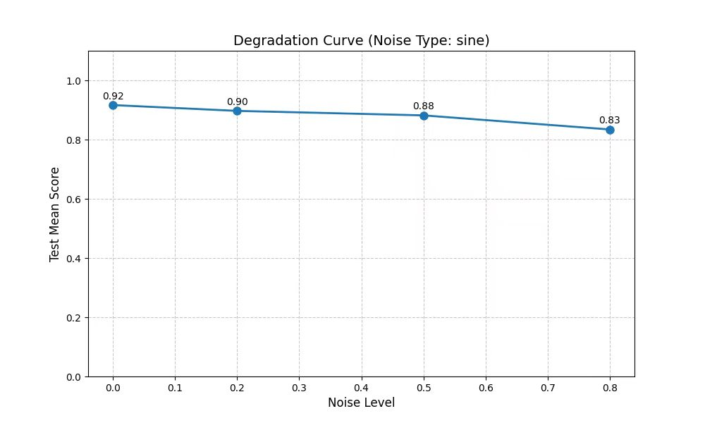
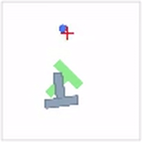
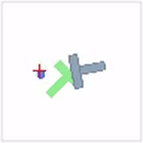

# Diffusion Policy — VLA Specialization

This repository extends the original [Diffusion Policy](https://diffusion-policy.cs.columbia.edu/) with a **Vision-Language-Action (VLA)** architecture for robotic manipulation. The key idea: replace the standard CNN image encoder with a frozen VLM backbone (SigLIP + Qwen), enabling language-conditioned policies with rich visual understanding.

## What's New

| File | Description |
|------|-------------|
| `diffusion_policy/policy/vla_diffusion_policy.py` | New VLA policy class: VLM backbone + TransformerForDiffusion |
| `diffusion_policy/model/backbone/vlm_backbone.py` | SigLIP vision encoder → linear projector → Qwen3-4B LLM |
| `diffusion_policy/model/common/lora_util.py` | Hand-crafted LoRA for SigLIP attention layers (no PEFT dependency) |
| `diffusion_policy/dataset/pusht_vla_image_dataset.py` | VLA-adapted PushT image dataset |
| `diffusion_policy/config/task/pusht_image_vla.yaml` | Task config for VLA PushT training |
| `diffusion_policy/config/train_diffusion_transformer_hybrid_workspace.yaml` | Training config with VLA-specific parameters |
| `diffusion_policy/policy/diffusion_transformer_hybrid_image_policy.py` | Added agent_pos encoder integration |
| `diffusion_policy/config/task/pusht_image.yaml` | Updated PushT image task config |
| `scripts/verify_vlm_lora.py` | Script to verify LoRA injection and trainability |
| `self_utils/visualize_train_log.py` | Offline training log visualization |

## Architecture

```
Observation (96×96 RGB image)
         │
    SigLIP ViT       ← frozen, with optional LoRA on Q/K/V/out_proj
    (768-dim tokens)
         │
    Linear Projector (768 → 2560)
         │
    Qwen3-4B     ← frozen, provides rich language-visual context
    (last 4 hidden states as conditioning)
         │
    + agent_pos (2D → 2560, learned)
         │
    TransformerForDiffusion  ← DDPM denoising
         │
    Action sequence (2D)
```

**Key design choices:**
- VLM is used as a **frozen feature extractor** — only LoRA and projector are trained
- LoRA (rank=8, alpha=16) applied to SigLIP's `q_proj`, `k_proj`, `v_proj`, `out_proj` — hand-crafted without PEFT library
- Language instruction: *"Push the T block to the target location."*
- Trained on PushT task (90 episodes, 50 test environments)

## Results

### Best Checkpoint

| Model | Training Score (epoch 275) |
|-------|---------------------------|
| VLA-LoRA (SigLIP + Qwen + LoRA) | **0.873** |

### Robustness Evaluation

Evaluated on PushT under two types of image degradation at varying intensities:

#### Patch Noise Robustness

| Noise Level | VLA-LoRA | UNet Baseline |
|-------------|----------|---------------|
| 0.0 (clean) | 0.753 | 0.917 |
| 0.2 | 0.259 | 0.235 |
| 0.5 | 0.121 | 0.142 |
| 0.8 | 0.095 | 0.132 |

#### Sine Noise Robustness

| Noise Level | VLA-LoRA | UNet Baseline |
|-------------|----------|---------------|
| 0.0 (clean) | 0.753 | 0.917 |
| 0.2 | 0.749 | 0.897 |
| 0.5 | 0.661 | 0.882 |
| 0.8 | 0.450 | 0.834 |

**Degradation curves (patch noise):**

| VLA-LoRA | UNet Baseline |
|----------|---------------|
|  |  |

**Degradation curves (sine noise):**

| VLA-LoRA | UNet Baseline |
|----------|---------------|
|  |  |

### Demo (VLA-LoRA, Clean Input)

<p float="left">
  
  
  
</p >

## Setup

```bash
conda env create -f conda_environment.yaml
conda activate robodiff
pip install -e .
```

**Model weights required:**
- `SigLIP_weights/`: [google/siglip-base-patch16-224](https://huggingface.co/google/siglip-base-patch16-224)
- `qwen_weights/`: [Qwen/Qwen3-4B](https://huggingface.co/Qwen/Qwen3-4B)

## Training

```bash
python train.py --config-name=train_diffusion_transformer_hybrid_workspace \
  task=pusht_image_vla
```

## Verify LoRA

```bash
SIGLIP_PATH=SigLIP_weights LLM_PATH=qwen_weights python scripts/verify_vlm_lora.py
```

## Base Repository

This project forks [columbia-ai-robotics/diffusion_policy](https://github.com/columbia-ai-robotics/diffusion_policy) at commit `5ba07ac`.
