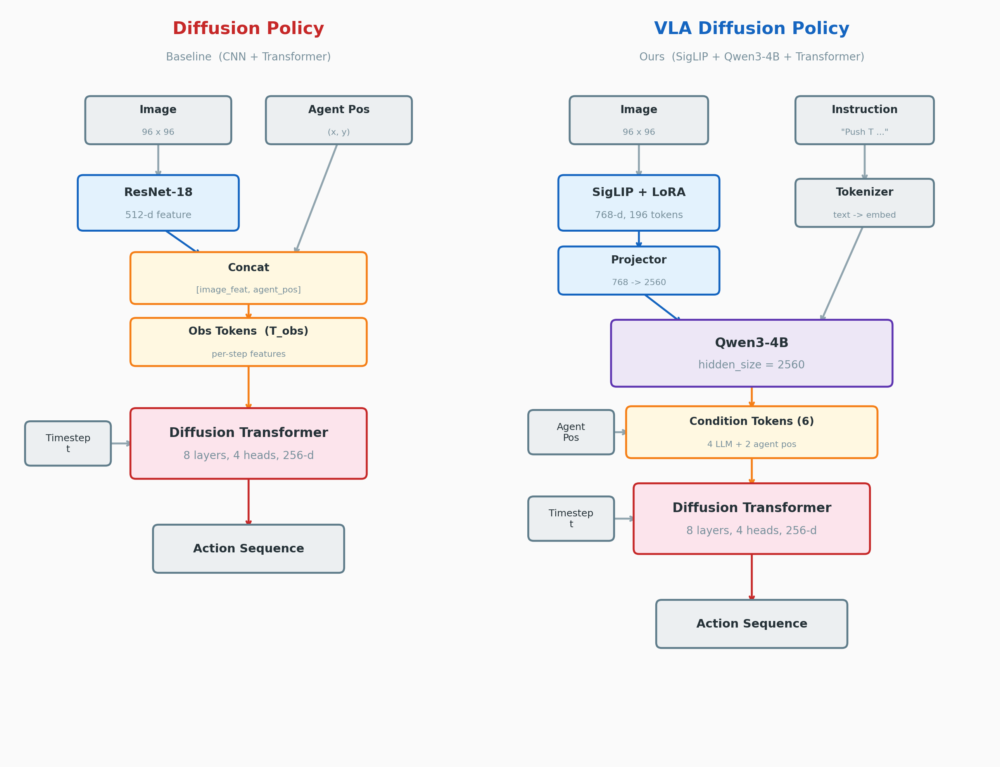
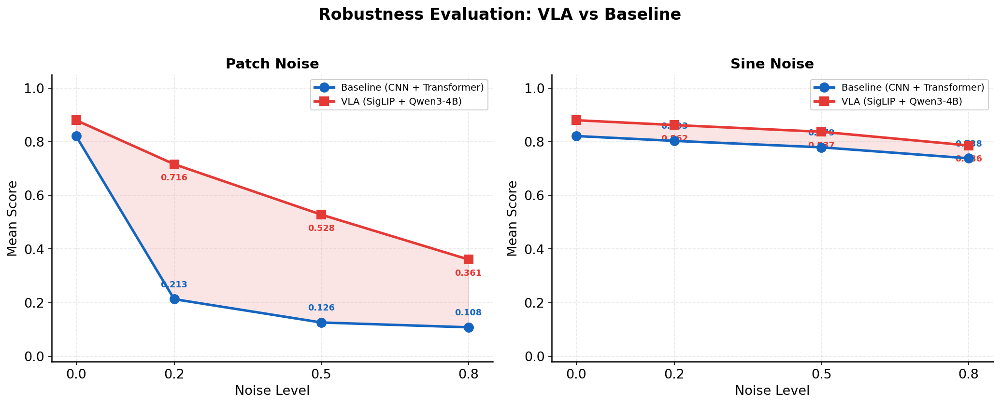
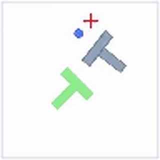
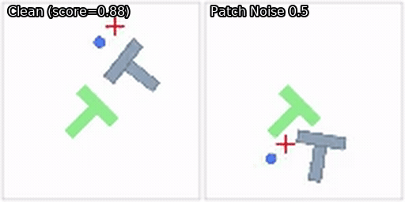
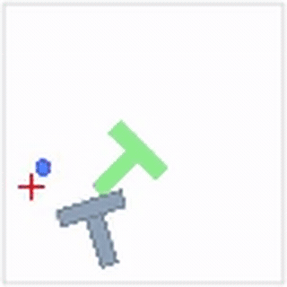
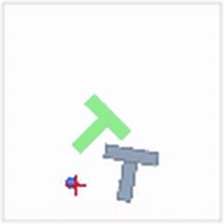

# Diffusion Policy with VLA Image Encoder (SigLIP + LoRA)

This repository extends [Diffusion Policy](https://github.com/real-stanford/diffusion_policy) by replacing the default CNN-based image encoder with a **Vision-Language Model (VLA) encoder** — specifically [SigLIP](https://arxiv.org/abs/2303.15343) fine-tuned via [LoRA](https://arxiv.org/abs/2106.09685), combined with a [Qwen3-4B](https://huggingface.co/Qwen/Qwen3-4B) backbone for cross-modal reasoning.

The key hypothesis: **a pretrained VLM encoder provides stronger visual representations that are more robust to input perturbations**, achieving higher task performance and significantly better noise robustness compared to the CNN-based baseline.

## Architecture

<p align="center">
  
</p>

The VLA variant replaces the original CNN encoder with a vision-language pipeline: **SigLIP** encodes images into visual tokens, which are projected and fed alongside instruction text into a **Qwen3-4B** backbone for cross-modal reasoning. The resulting hidden states, combined with agent position tokens, condition a **Diffusion Transformer** to predict actions.

## Results

### Task Performance (PushT)

| Model | Encoder | Clean Score |
|-------|---------|:-----------:|
| Diffusion Policy (baseline) | ResNet-18 (CNN + Transformer) | 0.821 |
| **Diffusion Policy + VLA** | SigLIP + LoRA + Qwen3-4B | **0.880** |

> The VLA variant **surpasses** the baseline by +0.059 on clean score, while leveraging pretrained visual-language representations for stronger generalization.

### Robustness Evaluation

We evaluate robustness by injecting visual noise into observations during inference. Two noise types are tested:
- **Patch noise**: random rectangular patches overlaid on the image (adversarial-style)
- **Sine noise**: smooth sinusoidal perturbations across the image (natural-style)

<p align="center">
  
</p>

| Noise Type | Level | Baseline (CNN) | VLA (Ours) | VLA Advantage |
|:----------:|:-----:|:--------------:|:----------:|:-------------:|
| Patch | 0.0 | 0.821 | **0.880** | **+0.059** |
| Patch | 0.2 | 0.213 | **0.716** | **+0.503** |
| Patch | 0.5 | 0.126 | **0.528** | **+0.402** |
| Patch | 0.8 | 0.108 | **0.361** | **+0.253** |
| Sine | 0.0 | 0.821 | **0.880** | **+0.059** |
| Sine | 0.2 | 0.803 | **0.862** | **+0.059** |
| Sine | 0.5 | 0.779 | **0.837** | **+0.058** |
| Sine | 0.8 | 0.738 | **0.786** | **+0.048** |

**Key finding**: The VLA encoder outperforms the baseline at **all noise levels**. Under patch noise, the CNN encoder suffers catastrophic degradation (0.821 -> 0.108), while the VLA encoder degrades gracefully (0.880 -> 0.361) — a **3.3x** improvement at noise level 0.8. This demonstrates the pretrained VLM's superior robustness to adversarial visual perturbations.

### Demo

<table>
<tr>
<td align="center"><b>Clean Environment</b></td>
<td align="center"><b>Clean vs Patch Noise</b></td>
</tr>
<tr>
<td align="center"></td>
<td align="center"></td>
</tr>
</table>

<table>
<tr>
<td align="center"><b>Example 1 (score=1.0)</b></td>
<td align="center"><b>Example 2 (score=0.999)</b></td>
<td align="center"><b>Example 3 (score=0.874)</b></td>
</tr>
<tr>
<td align="center"></td>
<td align="center"></td>
<td align="center"></td>
</tr>
</table>

## Modified Files

The following files were modified or added relative to the [original Diffusion Policy repo](https://github.com/real-stanford/diffusion_policy):

| File | Description |
|------|-------------|
| `diffusion_policy/model/vision/siglip_obs_encoder.py` | SigLIP image encoder with LoRA integration |
| `diffusion_policy/model/vision/siglip_wrapper.py` | SigLIP model loading and preprocessing |
| `diffusion_policy/model/vision/verify_vlm_lora.py` | LoRA verification utility |
| `diffusion_policy/workspace/train_diffusion_unet_image_workspace.py` | Updated workspace to support VLA encoder |
| `diffusion_policy/config/task/pusht_image.yaml` | Task config with VLA encoder settings |
| `diffusion_policy/config/train_diffusion_unet_image_workspace_config.yaml` | Training config for VLA |
| `eval_noise_degradation.py` | Noise robustness evaluation script |
| `visualize_train_log.py` | Training log visualization |

## Training

```bash
# Train VLA variant
python train.py --config-name=train_diffusion_unet_image_workspace_config \
    task=pusht_image \
    training.use_lora=True

# Evaluate with noise degradation
python eval_noise_degradation.py \
    --checkpoint data/outputs/train_image_encoder/checkpoints/epoch=0275-test_mean_score=0.873.ckpt \
    --noise_type patch \
    --noise_levels 0.0 0.2 0.5 0.8
```

## Acknowledgments

- [Diffusion Policy](https://github.com/real-stanford/diffusion_policy) — Chi et al., RSS 2023
- [SigLIP](https://arxiv.org/abs/2303.15343) — Zhai et al., ICCV 2023
- [LoRA](https://arxiv.org/abs/2106.09685) — Hu et al., ICLR 2022
